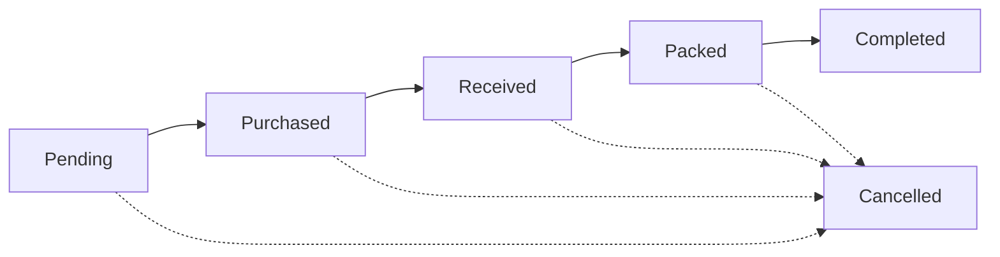

# 🛒 SuSeeOS

An internal tool for a Myanmar-based **cross-border resale business**. The
day looks like this:

1. 💬 A **Support Agent** takes a customer's request and logs it as an
   **Order** against the shared product catalog.
2. 🛍️ A **Supplier** in Thailand sees every pending line grouped by product
   and buys them from Lazada / TikTok Shop in one pass.
3. 📦 The items arrive with the Support Agent, who **packs and ships** them
   to the real customer.

It replaces a pile of spreadsheets and group chats. It is a **phone app
first** — designed at 375px, monochrome, and meant to feel like something
you installed, not a page you loaded.

Every line of every order moves through its own lifecycle:



Any stage can drop to **Cancelled** (couldn't source it, customer changed
their mind). `Received` is the pivotal one — the physical signal that
unlocks packing — which is why status lives on the *item*, not the whole
order.

---

## 🧭 How it's modelled

| Concept | What it is |
|---|---|
| **Organization** | The tenant. One business account, fully isolated from every other — the boundary is enforced by **Postgres row-level security**, not app code. |
| **Store** | A location *within* an Organization. Orders, customers and parcels belong to one Store; the product catalog is shared Organization-wide. A member is granted specific Stores and switches between them. |
| **Admin / Support Agent / Supplier** | The three roles. Admin's access is a superset of the other two. A person can hold different roles in different Organizations with one login. |
| **Order → Order Item** | An Order is a header (who, when). Each **Order Item** carries its own status — `pending → purchased → received → packed → completed` (+ `cancelled` from anywhere) — because the Supplier's queue batches items by *product* across many orders, not by whole order. |

The full glossary is [`CONTEXT.md`](./CONTEXT.md); the decisions behind it
are in [`docs/adr/`](./docs/adr/).

## 🧱 Stack

**Next.js 16** (App Router, Turbopack) on **Vercel** · **Neon** Postgres
with RLS · **Drizzle** ORM · **better-auth** · **Tailwind v4** + shadcn/ui ·
**nuqs** · **Cloudflare R2** for images · **Vitest** · **pnpm**.

Rationale — and the alternatives that were rejected — in
[`docs/TECH_STACK.md`](./docs/TECH_STACK.md).

---

## 🚀 Running it locally

### Prerequisites

- **Node 22+** and **pnpm 9+** (`corepack enable` if you don't have pnpm)
- A **Neon** account and the CLI (`npx neon …` works with no install)
- *(optional)* a **Cloudflare R2** bucket — only needed for image/screenshot
  uploads; the app runs fine without one

### 1 · Install

```bash
pnpm install
```

### 2 · Point at a database

```bash
npx neon auth                 # sign in (once)
npx neon link                 # link this repo to the Neon project (once) → writes .neon
npx neon checkout dev         # pin + pull a branch's DATABASE_URL into .env.local
```

`neon checkout` writes `DATABASE_URL` and `DATABASE_URL_UNPOOLED` for
whatever Neon branch you pick. **Pick a dev/staging branch — never
production** — because step 4 runs migrations against it.

### 3 · Create the `app_user` role  ⚠️ not optional

`neon checkout` gives you the **owner** role. Migrations need that, but the
*app* must connect as a lower-privileged `app_user` — RLS doesn't apply to
the owner, so running the app as owner **silently disables every tenant
boundary**.

Create it with **plain SQL** (not `neon roles create` or the console —
those grant `BYPASSRLS`):

```sql
create role app_user with login password 'pick-something';
grant usage on schema public to app_user;
grant select, insert, update, delete on all tables in schema public to app_user;
```

Then in `.env.local`, set `DATABASE_URL` to `app_user`'s **pooled**
connection string (keep the owner URL in `DATABASE_URL_UNPOOLED`). Full
reasoning: [`docs/TECH_STACK.md`](./docs/TECH_STACK.md#neon-role-setup-app_user-vs-the-owner-role).

### 4 · Fill in the rest of `.env.local`

Copy the remaining keys from [`.env.example`](./.env.example):

```bash
# a fresh signing secret:
node -e "console.log(require('crypto').randomBytes(32).toString('base64url'))"
```

| Key | Needed? |
|---|---|
| `BETTER_AUTH_SECRET` | ✅ generate one |
| `BETTER_AUTH_URL` | ✅ `http://localhost:3000` |
| `R2_*` | ⬜ only for image uploads |

### 5 · Migrate and seed

```bash
pnpm db:migrate                        # apply the schema
pnpm tsx scripts/seed-test-data.mts    # test Organizations, Stores and accounts
```

### 6 · Go

```bash
pnpm dev
```

Open **[localhost:3000](http://localhost:3000)** and sign in with a seeded
account (all password `password123`) — the login screen lists them, each
one wired to a different Organization/Store situation:

| Account | Lands on |
|---|---|
| `admin@test.local` | straight in — Test Store, no switcher |
| `cs@test.local` | straight in — Test Store, no switcher |
| `cs2@test.local` | straight in — Second Reseller, no switcher |
| `supplier@test.local` | straight in, with the Store switcher in Settings (both Stores) |

*(No public signup. Bootstrap the first Store with `pnpm store:create`.
After that, a **platform operator** — a `users.role = "platform_admin"`
account with no tenant membership, created via `pnpm platform:add` —
provisions more from the operator console at `/platform`.)*

---

## 🛠️ Scripts

| Command | Does |
|---|---|
| `pnpm dev` | Next dev server (Turbopack) |
| `pnpm build` / `pnpm start` | production build / serve |
| `pnpm lint` | ESLint |
| `pnpm test` / `pnpm test:watch` | Vitest (see [Testing](#-testing)) |
| `pnpm db:generate` | generate SQL migration from `src/db/schema.ts` |
| `pnpm db:migrate` | apply migrations (via `DATABASE_URL_UNPOOLED`) |
| `pnpm db:studio` | Drizzle Studio — browse the DB |
| `pnpm store:create "<Store>" <email> "<Name>" <pw> [role]` | provision a Store + first Admin |
| `pnpm platform:add <email> "<Name>" <pw>` | create a platform-operator account — ready to sign in immediately |
| `pnpm platform:grant <email>` | promote an existing account to platform operator |
| `pnpm member:add <email> <store-slug> <role> ["<Name>" <pw>]` | add someone to a Store (creates the account if new) |
| `pnpm tsx scripts/seed-test-data.mts` | (re)create the dev accounts above |

## 🧪 Testing

```bash
pnpm test
```

Tests run against a **real Neon database**, not a mock — the tenant
boundary *is* Postgres RLS, so stubbing the database out would test
nothing. `tests/tenant-isolation.test.ts` proves one Organization can't
read another's rows *even through a query that forgot its `WHERE`*, and
fails loudly if the policy is ever dropped. `DATABASE_URL` must point at
`app_user` when you run them.

## 🗂️ Project layout

```
src/
  app/
    (auth)/         login · change-password · invite/accept
    (dashboard)/    the app — orders · parcels · purchase-queue · customers
                    · products · admin/staff · settings
  components/ui/    the design-system kit (Button, Row, Sheet, TopBar …)
  db/               schema.ts · client.ts (RLS scope) · migrations/
  lib/
    auth/           the only file that imports better-auth
    tenancy.ts      withCurrentOrganization
  services/         business rules — no framework imports, unit-testable
scripts/            provisioning + seed (run with tsx)
docs/               PRD · TECH_STACK · DATA_MODEL · adr/
```

`services/` holds the rules; `app/**/actions.ts` are thin wrappers that
only do what a service can't — read the session and tell Next what to
re-render. See [`docs/ARCHITECTURE_ROADMAP.md`](./docs/ARCHITECTURE_ROADMAP.md).

## 🌱 Branches & deploys

Two long-lived branches:

- **`dev`** — the default branch and integration target → **staging**
- **`main`** — **production**, only updated by a `dev` → `main` release PR

Day to day: branch off `dev` as `feat/…` · `fix/…` · `chore/…`, open a PR
back into `dev` for a Vercel preview, merge. **Neon branches the database
per PR**, so a migration in a PR runs against isolated data and never
touches production. Merged branches auto-delete; a weekly Action prunes any
branch idle for 30+ days (never `dev`, `main`, `prototype/*`, or a branch
with an open PR).

## 📚 Docs

| | |
|---|---|
| [`CONTEXT.md`](./CONTEXT.md) | domain model & vocabulary — **read first** |
| [`CLAUDE.md`](./CLAUDE.md) | working agreements, UI conventions, git flow |
| [`docs/PRD.md`](./docs/PRD.md) | product requirements |
| [`docs/TECH_STACK.md`](./docs/TECH_STACK.md) | stack & infra decisions |
| [`docs/DATA_MODEL.md`](./docs/DATA_MODEL.md) | schema, RLS, ER diagram |
| [`docs/ARCHITECTURE_ROADMAP.md`](./docs/ARCHITECTURE_ROADMAP.md) | what's next |
| [`docs/adr/`](./docs/adr/) | [0001](./docs/adr/0001-order-item-lifecycle-and-packing.md) order lifecycle · [0002](./docs/adr/0002-multi-tenancy-mvp.md) multi-tenancy · [0003](./docs/adr/0003-password-recovery-and-forced-change.md) passwords · [0004](./docs/adr/0004-stores-within-an-organization.md) stores |
