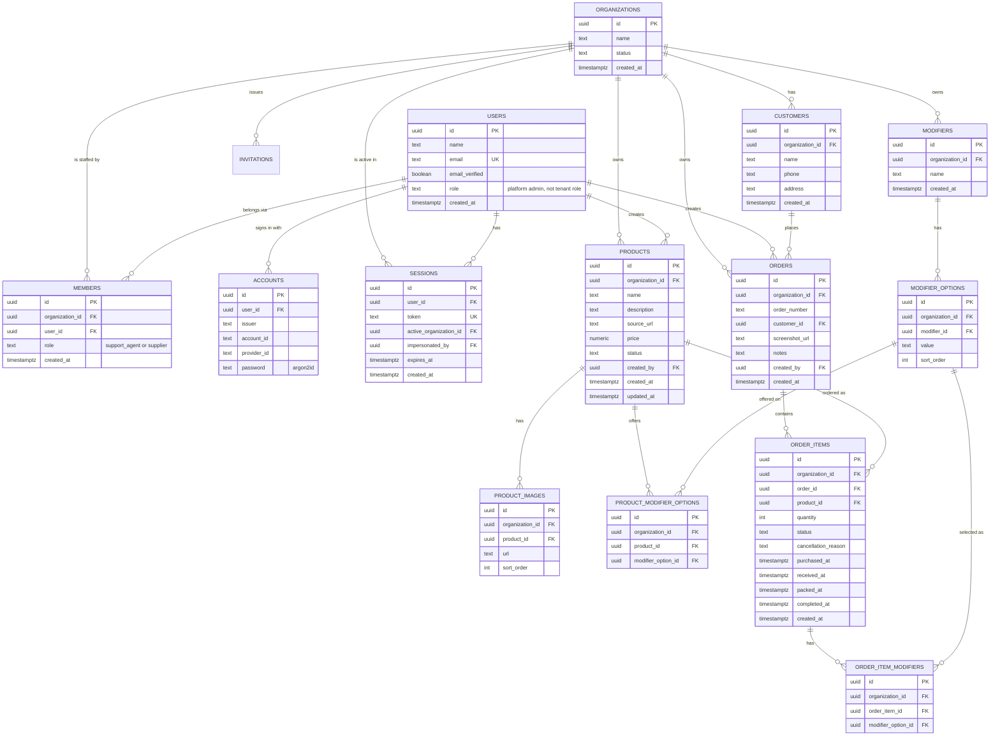

# Data Model

**Status:** Draft v4
**Last updated:** 2026-09-12
**Related:** [PRD.md](./PRD.md), [TECH_STACK.md](./TECH_STACK.md), [CONTEXT.md](../CONTEXT.md), [ADR-0001](./adr/0001-order-item-lifecycle-and-packing.md), [ADR-0002](./adr/0002-multi-tenancy-mvp.md)

Multi-tenant from day one: every tenant-scoped table carries an
`organization_id`. Identity is separate from membership — a person is one
`users` row and one `members` row per Organization they work for, and the
*active* one lives on the session ([ADR-0002](./adr/0002-multi-tenancy-mvp.md)).
See
[TECH_STACK.md §4](./TECH_STACK.md#4-multi-tenancy--the-decision-that-matters-more-than-tool-choice)
for why, and §5 below for how it's actually enforced (it's not just the
column).

## 1. ER overview



## 2. Enums

| Enum | Values | Used by |
|---|---|---|
| `organization_status` | `active`, `suspended` | `organizations.status` |
| `product_status` | `active`, `archived` | `products.status` |
| `order_item_status` | `pending`, `purchased`, `received`, `packed`, `completed`, `cancelled` | `order_items.status` |

**Roles are not a pg enum.** `members.role` is `text`, because better-auth
writes comma-separated values for a member holding several roles, which an
enum cannot store. The `user_role` enum that used to guard this was retired
once the column moved; `AppRole` in `src/lib/auth` is the real union and the
thing that gives compile-time safety.

Joining a Store is by invitation only (ADR-0005 §6) — a Platform Admin
invites a Store's first Admin, who invites their own staff from `/admin/staff`
the same way. `pnpm store:create` / `pnpm member:add` remain the CLI
escape hatch — see [ADR-0002](./adr/0002-multi-tenancy-mvp.md) decision 10 —
but nobody sets anyone else's password anymore; the invitee always chooses
their own on accept.

## 3. Tables

### `organizations`
The tenant — one row per Store (ADR-0005 Phase 3 collapsed the sub-Store
layer that used to sit under this; the table/column name is the one part
of that history the rename didn't reach — see CONTEXT.md's "Store").

| Column | Type | Notes |
|---|---|---|
| `id` | `uuid` PK | |
| `name` | `text` | |
| `slug` | `text` UNIQUE | required by better-auth's organization plugin. Nothing routes by it — ADR-0002 keeps the Organization out of the URL — but it is populated so subdomains stay possible without a backfill |
| `logo` | `text` | unused; part of the plugin's shape |
| `metadata` | `text` | unused; part of the plugin's shape |
| `status` | `organization_status` | default `active`. Checked on every request; a suspended Organization resolves to no session |
| `created_at` | `timestamptz` | default `now()` |

### Auth tables

Owned by [better-auth](https://better-auth.com) and its organization and
admin plugins ([ADR-0002](./adr/0002-multi-tenancy-mvp.md)). The shapes are
dictated by `@better-auth/core`, but expressed in this schema's conventions:
`uuid` primary keys rather than better-auth's default text ids
(`advanced.database.generateId: "uuid"` makes it match), and `timestamptz`
throughout.

**None of these carry RLS**, and that is not an oversight — see §5.

### `users`
The person, not the membership. A Supplier sourcing for two resellers is one
row here with two `members` rows.

| Column | Type | Notes |
|---|---|---|
| `id` | `uuid` PK | |
| `name` | `text` | |
| `email` | `text` UNIQUE | globally unique, which is correct: it identifies a person, not a person-within-an-Organization |
| `email_verified` | `boolean` | default `false`; unused until a verification flow ships |
| `image` | `text` | unused |
| `role` | `text` | **platform** administration (the operator), not the tenant role. Left null in practice — admins are allowlisted by id via `PLATFORM_ADMIN_USER_IDS` |
| `banned` / `ban_reason` / `ban_expires` | | from the admin plugin; unused so far |
| `created_at`, `updated_at` | `timestamptz` | default `now()` |

No password column: credentials live on `accounts`.

### `members`
Which Organization a person belongs to, and what they do there.

| Column | Type | Notes |
|---|---|---|
| `id` | `uuid` PK | |
| `organization_id` | `uuid` FK → `organizations.id` | `ON DELETE CASCADE` |
| `user_id` | `uuid` FK → `users.id` | `ON DELETE CASCADE` |
| `role` | `text` NOT NULL | `support_agent` or `supplier` — see §2 on why this is not an enum |
| `created_at` | `timestamptz` | default `now()` |

**Indexes:** `(organization_id, user_id)` UNIQUE, `(organization_id)`, `(user_id)`

### `accounts`
Credentials and linked provider accounts.

| Column | Type | Notes |
|---|---|---|
| `id` | `uuid` PK | |
| `issuer` | `text` NOT NULL | `local:credential` for password logins. **Required**, and omitted by older better-auth CLI output — leaving it out breaks sign-in |
| `account_id` | `text` NOT NULL | the user's id, for credential accounts |
| `provider_id` | `text` NOT NULL | `credential` for password logins |
| `user_id` | `uuid` FK → `users.id` | `ON DELETE CASCADE` |
| `password` | `text` | argon2id hash — the same format the old `users.password_hash` held, moved verbatim so no user had to reset |
| `access_token`, `refresh_token`, `id_token`, `scope`, expiry columns | | OAuth; unused |

**Indexes:** `(issuer, account_id)` UNIQUE, `(user_id)`

### `sessions`
Backs the session cookie.

| Column | Type | Notes |
|---|---|---|
| `id` | `uuid` PK | |
| `user_id` | `uuid` FK → `users.id` | `ON DELETE CASCADE` |
| `token` | `text` UNIQUE | stored as issued. A downgrade from the hash-only column this replaced — accepted knowingly, see [better-auth-spike.md §2](./research/better-auth-spike.md) |
| `active_organization_id` | `uuid` FK → `organizations.id` | **the tenancy seam — and, since ADR-0005 Phase 3, the active Store too.** `src/lib/tenancy.ts` reads this; switching Store re-stamps it |
| `impersonated_by` | `uuid` FK → `users.id` | set while a platform admin acts as this user |
| `ip_address`, `user_agent` | `text` | |
| `expires_at` | `timestamptz` NOT NULL | |
| `created_at`, `updated_at` | `timestamptz` | default `now()` |

**Indexes:** `(token)` UNIQUE, `(user_id)`

### `invitations`
Joining a Store is by invitation only (ADR-0005 §6) — the org plugin's own
table, no RLS (it must be readable pre-auth, by an invitee with no session
yet, to accept it at all). See `src/lib/auth/index.ts`'s "Invitations"
section for the accept flow.

### `verifications`
Required by the plugins' schema; stays empty until an email-verification
flow ships.

### `impersonation_events`
Append-only audit of support impersonation. Not part of better-auth:
`sessions.impersonated_by` is deleted along with the session, which is the
wrong property for a record of one company's staff reading another
company's customer data. Nothing in the app deletes from this table.

| Column | Type | Notes |
|---|---|---|
| `id` | `uuid` PK | |
| `admin_user_id` | `uuid` FK → `users.id` | who acted |
| `target_user_id` | `uuid` FK → `users.id` | who they acted as |
| `organization_id` | `uuid` FK → `organizations.id` | nullable |
| `started_at` | `timestamptz` | default `now()` |
| `ended_at` | `timestamptz` | stamped before the session swaps back |

**Index:** `(admin_user_id, started_at)`

### `customers`
A real, searchable entity (PRD §5.3) — not free text on the order. One
record per person per tenant (ADR-0005 Phase 2), matching Products: no
longer denormalized to the Store they first walked into, so a Customer
placing at two Stores in the same Organization is one row, not two.

| Column | Type | Notes |
|---|---|---|
| `id` | `uuid` PK | |
| `organization_id` | `uuid` FK → `organizations.id` | |
| `name` | `text` NOT NULL | |
| `phone` | `text` NOT NULL | |
| `address` | `text` | nullable at the DB level only for a handful of test customers that predate this field — required on the create-customer form for everyone going forward; needed to actually ship a Purchased item |
| `created_at` | `timestamptz` | default `now()` |

**Index:** `(organization_id, name)` — powers search-or-create while
logging an order, across every Store in the Organization

### `products`
The catalog entry.

| Column | Type | Notes |
|---|---|---|
| `id` | `uuid` PK | |
| `organization_id` | `uuid` FK → `organizations.id` | |
| `name` | `text` NOT NULL | |
| `description` | `text` NOT NULL | |
| `source_url` | `text` | nullable — the highest-leverage field, PRD §9.1. No separate marketplace column; the URL alone is enough. |
| `price` | `numeric(12,2)` | nullable; MMK, customer-facing (PRD §5.1) |
| `status` | `product_status` | default `active` |
| `created_by` | `uuid` FK → `users.id` | |
| `created_at` / `updated_at` | `timestamptz` | |

**Indexes:** `(organization_id, status)`, `(organization_id, name)`

Note the `modifiers` JSONB column from the previous schema draft is
**gone** — modifiers are now relational (see below).

### `product_images`
One-to-many, ordered.

| Column | Type | Notes |
|---|---|---|
| `id` | `uuid` PK | |
| `organization_id` | `uuid` FK | denormalized — see §5 |
| `product_id` | `uuid` FK → `products.id` | `ON DELETE CASCADE` |
| `url` | `text` NOT NULL | R2 object URL |
| `sort_order` | `int` | default `0`; index 0 = primary/thumbnail |

**Index:** `(product_id, sort_order)`

### `modifiers`
An Organization-wide, reusable attribute type (PRD §5.2) — e.g. "Color".
Created inline while creating/editing a Product.

| Column | Type | Notes |
|---|---|---|
| `id` | `uuid` PK | |
| `organization_id` | `uuid` FK | |
| `name` | `text` NOT NULL | e.g. `"Color"` |
| `created_at` | `timestamptz` | |

**Index:** UNIQUE `(organization_id, name)` — prevents creating "Color"
twice by accident from two different inline-creation flows

### `modifier_options`
One value within a Modifier — e.g. "Black" within "Color". The global
list; a Product picks a subset (see `product_modifier_options`).

| Column | Type | Notes |
|---|---|---|
| `id` | `uuid` PK | |
| `organization_id` | `uuid` FK | denormalized |
| `modifier_id` | `uuid` FK → `modifiers.id` | `ON DELETE CASCADE` |
| `value` | `text` NOT NULL | e.g. `"Black"` |
| `sort_order` | `int` | default `0` |

**Index:** UNIQUE `(modifier_id, value)`

### `product_modifier_options`
Join table: which of a Modifier's global Options actually apply to a
given Product. (Which *Modifiers* a Product uses is derivable by joining
through this table — no separate `product_modifiers` table needed.)

| Column | Type | Notes |
|---|---|---|
| `id` | `uuid` PK | |
| `organization_id` | `uuid` FK | denormalized |
| `product_id` | `uuid` FK → `products.id` | `ON DELETE CASCADE` |
| `modifier_option_id` | `uuid` FK → `modifier_options.id` | `ON DELETE CASCADE` |

**Index:** UNIQUE `(product_id, modifier_option_id)`

### `orders`
A Customer's request (PRD §5.4) — a **header only**. No per-item status
lives here; see `order_items`. `placed_at` is the one exception: it's not a
lifecycle status, just the draft/placed line — the order wizard writes a row
as soon as a customer's picked (with however many items were added before
the wizard was closed), and `placed_at` distinguishes "still being composed"
from "handed off" without needing a full status column.

| Column | Type | Notes |
|---|---|---|
| `id` | `uuid` PK | |
| `organization_id` | `uuid` FK | |
| `order_number` | `text` NOT NULL | random 6 characters from the same misread-proof alphabet as temporary passwords (`services/password.ts`'s `READABLE_ALPHABET`), unique per Organization (`orders_organization_order_number_unique`) — what's actually said aloud or typed to find an order, not `id`. Drawn by `pickOrderNumber` in `services/orders.ts`; deliberately not sequential, so two of them can't be compared to guess how many orders this Store has ever placed |
| `customer_id` | `uuid` FK → `customers.id` NOT NULL | |
| `screenshot_url` | `text` | nullable — R2 object URL |
| `notes` | `text` | nullable |
| `created_by` | `uuid` FK → `users.id` | the Support Agent who logged it |
| `created_at` | `timestamptz` | |
| `placed_at` | `timestamptz` | nullable — null means still a draft |

**Indexes:** `(organization_id, customer_id)`, `(organization_id, created_at, id)`

### `order_items`
One line of an Order (PRD §5.5) — the unit the Supplier's Purchase Queue
and Support Agent's Packing Queue actually operate on. **Status lives
here, not on `orders`** — see
[ADR-0001](./adr/0001-order-item-lifecycle-and-packing.md).

| Column | Type | Notes |
|---|---|---|
| `id` | `uuid` PK | |
| `organization_id` | `uuid` FK | denormalized |
| `order_id` | `uuid` FK → `orders.id` NOT NULL | `ON DELETE CASCADE` |
| `product_id` | `uuid` FK → `products.id` NOT NULL | |
| `quantity` | `int` NOT NULL | default `1` |
| `status` | `order_item_status` NOT NULL | default `pending` |
| `cancellation_reason` | `text` | nullable, set when status → `cancelled`. A fixed sentinel string (`CANT_SOURCE_REASON` in `db/schema.ts`) marks the Purchase Queue's "Can't source" path specifically — that's how `/unsourced` finds only those, distinct from a Support-initiated cancel on the Order detail page |
| `cancelled_at` / `purchased_at` / `received_at` / `packed_at` / `completed_at` | `timestamptz` | nullable, set on each transition — `cancelled_at` is what makes cancellation a soft delete rather than the row silently going stale with no record of when |
| `created_at` | `timestamptz` | |

**Indexes:**
- `(organization_id, product_id, status)` — powers the Purchase
  Queue: group pending items by product, across every order/customer
- `(organization_id, status, created_at)` — powers the Packing
  Queue and general order-log filtering
- `(organization_id, order_id)` — look up an order's items

### `order_item_modifiers`
Join table: which Modifier Option(s) were selected for this line — e.g.
Color=Black *and* Size=M on the same item.

| Column | Type | Notes |
|---|---|---|
| `id` | `uuid` PK | |
| `organization_id` | `uuid` FK | denormalized |
| `order_item_id` | `uuid` FK → `order_items.id` | `ON DELETE CASCADE` |
| `modifier_option_id` | `uuid` FK → `modifier_options.id` | |

**Index:** UNIQUE `(order_item_id, modifier_option_id)`

## 4. Why `organization_id` is denormalized onto every table

Most of the FKs above (`product_images.product_id`,
`order_items.order_id`, `product_modifier_options.product_id`, etc.)
could derive their organization transitively through a join. It's
stored directly on every table anyway because:

1. **RLS policies stay uniform and joinless** — every policy is
   `organization_id = current_setting('app.organization_id')::uuid`, on
   every table, no exceptions to remember.
2. **A single missed join can't leak data.** If a query anywhere forgot
   to join back to check tenant ownership, the direct column means RLS
   still catches it.

There used to be a second, weaker denormalization here too — `store_id` on
`orders`/`order_items`, for reason 1 only (Store was a tag, not a tenant
boundary, so it carried no RLS policy of its own). ADR-0005 Phase 3 dropped
the column along with the sub-Store layer it named; `organization_id` is
the only scope left, anywhere.

## 5. Row-Level Security — enforced two ways, and neither is optional

Every tenant-scoped table has RLS enabled, and the app additionally filters
every query by `organization_id` explicitly.

The exceptions are the auth tables — `organizations`, `users`, `members`,
`accounts`, `sessions`, `invitations`, `verifications` and
`impersonation_events`. Each is read in order to *establish* the tenant
scope, so none can be gated on it. `members` is the one to watch: it
answers "which Store is this request in", so a query against it must be
scoped by hand.

Both layers matter, and this is **verified in CI** rather than by
inspection — `tests/tenant-isolation.test.ts` asserts that a scope on one
Organization cannot read another's rows through a query that omits its own
filter, and that the test itself fails when the policy is dropped. The
original manual verification surfaced two gotchas that would otherwise have
made this whole section a no-op:

```sql
alter table customers enable row level security;
alter table customers force row level security;
create policy tenant_isolation on customers
  using (organization_id = current_setting('app.organization_id')::uuid);
-- ...repeated for products, product_images, modifiers, modifier_options,
-- product_modifier_options, orders, order_items, order_item_modifiers
```

1. **`ENABLE` alone doesn't apply to the table owner** — Postgres
   exempts it by default. Every table above needs `FORCE ROW LEVEL
   SECURITY` too.
2. **Any Postgres role created via Neon's console/CLI/API gets
   `BYPASSRLS`** (via `neon_superuser` membership), which overrides
   `FORCE` regardless. The app connects as a role created with **plain
   SQL** instead. Full detail, and the exact `CREATE ROLE`/`GRANT`
   statements, in
   [TECH_STACK.md](./TECH_STACK.md#neon-role-setup-app_user-vs-the-owner-role).

The app sets `app.organization_id` at the start of each request by
resolving the session cookie → `sessions.active_organization_id`,
inside the same transaction as the queries that follow it (necessary
because Neon's pooled HTTP driver doesn't hold session state across
separate calls — see `src/db/client.ts`).

## 6. Deferred (not in MVP schema)

Per PRD §3 and §9 — intentionally not modeled yet:

- Payment/deposit status on `order_items`
- Multi-Supplier claiming (`claimed_by`, `claimed_at` on `order_items`)
- Ad-hoc order items without a `product_id`
- A distinct `shipped` value in `order_item_status` — deliberately
  skipped, see [ADR-0001](./adr/0001-order-item-lifecycle-and-packing.md)
- In-app account management (`users` are created by script, not UI)
